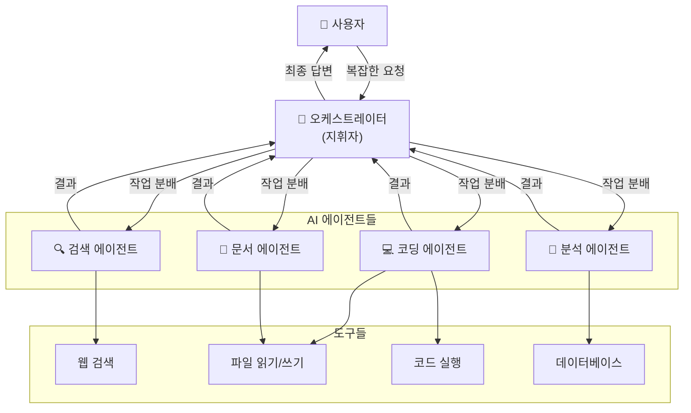
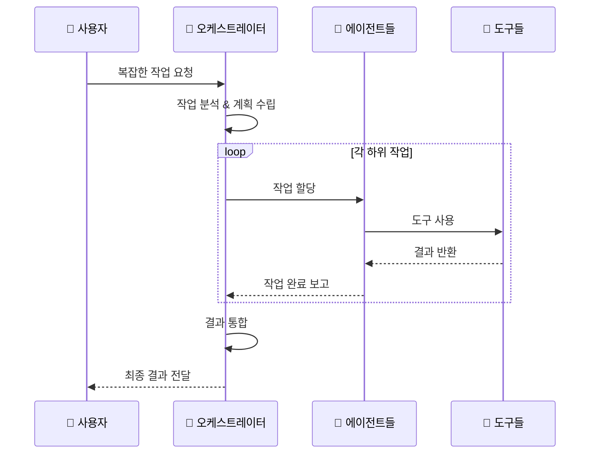

# 에이전트 오케스트레이션 (Agent Orchestration)

## 개념

**에이전트 오케스트레이션**은 여러 AI 에이전트를 **지휘자(Orchestrator)**가 조율하여 복잡한 작업을 수행하는 방식입니다.

---

## 구조 다이어그램

---

## 작업 흐름

---

## 비유: 오케스트라

| 오케스트라 | 에이전트 오케스트레이션 |
|-----------|----------------------|
| 지휘자 | 오케스트레이터 (메인 AI) |
| 연주자들 | 각 전문 에이전트 |
| 악기 | 도구 (Tools) |
| 악보 | 작업 계획 |
| 공연 | 최종 결과물 |

---

## 장점

1. **병렬 처리** - 여러 에이전트가 동시에 작업
2. **전문화** - 각 에이전트가 특정 영역에 특화
3. **복잡한 작업 처리** - 큰 작업을 작은 단위로 분할
4. **확장성** - 필요에 따라 에이전트 추가 가능
